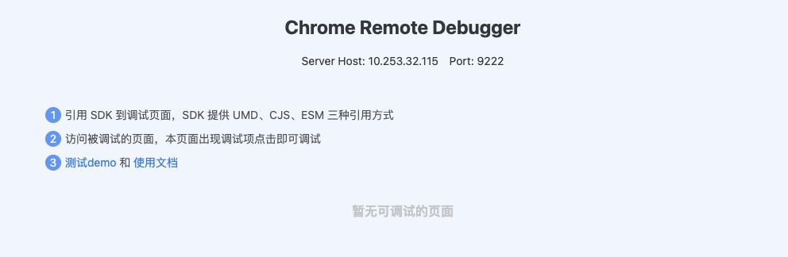

# Chrome Remote Debugger

To debugging web page by Chrome DevTools Protocol.

## Install

```sh
yarn global add chrome-remote-debugger
# OR
npm install chrome-remote-debugger -g
```

## Usage

### Start

```sh
crd start
```

The tool will start on port `9222` by default. If you want to set port, then use `-p` or `--port` short args:

```sh
crd start [-p, --port <port>]
```

### Open Board

The board UI start autoing at browser when you use start command.



### Import to client to your page

Debugging page must import our client to your page. The client supports three import mode.

Import as `ESM` or `CJS` , then install package by npm:

```sh
yarn add chrome-remote-debugger-client
# OR
npm install chrome-remote-debugger-client --save
```

* **ESM**:

```js
import CRD from 'chrome-remote-debugger-client'
```

* **CJS**

```js
const CRD = require('chrome-remote-debugger-client')
```

* **UMD**

```html
<script type="text/javascript" src="crd.umd.min.js"></script>
```

Then you can new a instance to use it:

```js
new CRD([options]).init()
```

## About Client

The supporting client in another warehouse is [Chrome Remote Debugger Client](https://github.com/mnichangxin/chrome-remote-debugger-client)
